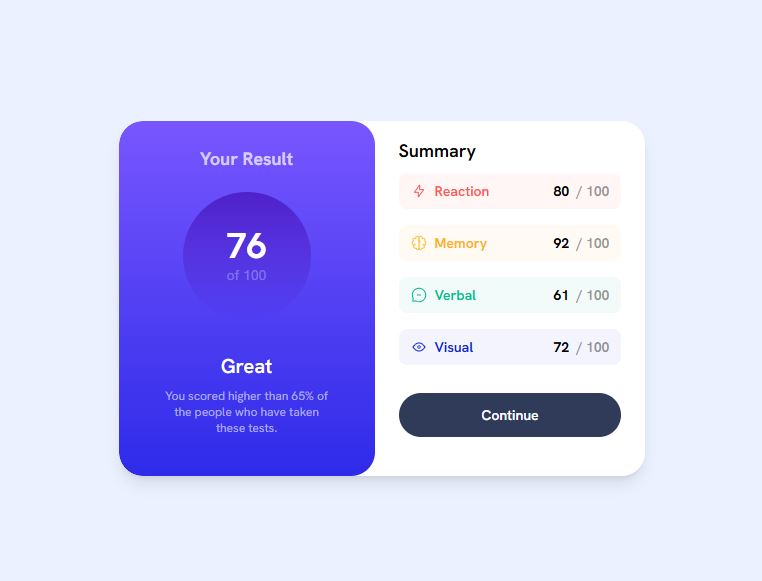

# Frontend Mentor - Results summary component solution

This is a solution to the [Results summary component challenge on Frontend Mentor](https://www.frontendmentor.io/challenges/results-summary-component-CE_K6s0maV). Frontend Mentor challenges help you improve your coding skills by building realistic projects.

## Table of contents

- [Overview](#overview)
  - [The challenge](#the-challenge)
  - [Screenshot](#screenshot)
  - [Links](#links)
- [My process](#my-process)
  - [Built with](#built-with)
  - [What I learned](#what-i-learned)
  - [Continued development](#continued-development)
- [Author](#author)

## Overview

### The challenge

Users should be able to:

- View the optimal layout for the interface depending on their device's screen size
- See hover and focus states for all interactive elements on the page
- **Bonus**: Use the local JSON data to dynamically populate the content

### Screenshot



### Links

- [Solution URL](https://your-solution-url.com)
- [Live Site URL](https://results-summary-mu-rosy.vercel.app/)

## My process

### Built with

- Semantic HTML5 markup
- [Tailwind CSS](https://tailwindcss.com/) - For styles
- [React](https://reactjs.org/) - JS library

### What I learned

- How to handle buggy behavior with Tailwind CSS and using string literals for colors in JSX. The fix was to add a safe list of colors in the tailwind.config.js file. I'm not entirely sure that 'safelists' were required in my situation but it solved my issue. See the [Tailwind CSS documentation](https://tailwindcss.com/docs/content-configuration#safelisting-classes) for more information.

For example:

```jsx
<p className={`pl-2 text-sm font-semibold md:pr-16 text-${item.color}`}>
```

`tailwind.config.js` file:

```js
safelist: [
    'bg-light-red', 'text-light-red',
    'bg-orangey-yellow', 'text-orangey-yellow',
    'bg-green-teal', 'text-green-teal',
    'bg-cobalt-blue', 'text-cobalt-blue',
  ],
```

- How to use Tailwind CSS utility classes to style gradient background
- How to handle more complicated CSS containers

### Continued development

I want to continue practicing with Tailwind CSS and learn more about the utility classes available. Also, I want to get faster and more comfortable.

### Useful resources

- [Tailwind Components Cheatsheet](https://tailwindcomponents.com/cheatsheet/overview) - This is a great resource for finding Tailwind CSS components and examples.
- [MDN Web Docs](https://developer.mozilla.org/en-US/docs/Web/CSS) - This is a great resource for finding information about CSS.
- [Tailwind CSS documentation](https://tailwindcss.com/docs) - This is the official Tailwind CSS documentation.

## Author

- Frontend Mentor - [@justinsane](https://www.frontendmentor.io/profile/justinsane)
- X - [@justinsane](https://www.x.com/justinsane)
